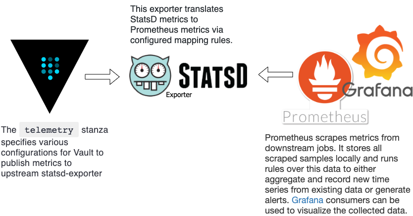

# Telemetry for Vault

## Architecture

This is a playground for showcasing telemetry in vault, the following architecture has bee implemented with docker containers and prepared to be span up using terraform:




## How to start

### Prerequisites
1. [Terraform installed] (https://www.terraform.io/downloads.html)
2. [Docker installed] (https://docs.docker.com/install/)
3. [Vault client installed] (https://www.vaultproject.io/intro/getting-started/install.html)

### Start the environment 
1. Initialize terraform plugins and modules: `terraform init`
2. Start the environment: `terraform apply`


## Vault configuration
Telemetry **stanza** is configured in vault configuration file [config.hcl](file:vault/config/config.hcl) by including the following configuration:

```
telemetry {
  statsd_address = "statsd_exporter:9125"
}
```

[Reference](https://www.vaultproject.io/docs/configuration/telemetry#statsd)

## Statsd-exporter configuration
**statsd-exporter** translates StatsD metrics to Prometheus metrics via configured mapping rules. Mapping rules are configured on the file [statsd_mapping.conf](file:statsd_mapping.conf) and copied to the container at startup time.

[Reference](https://github.com/prometheus/statsd_exporter)

## Prometheus configuration
**prometeus** is configured via command-line flags and a configuration file [prometheus.yml](file:sprometheus.yml). The file is also copied to the container at startup time.

A *scrape_config* section is defined as a single job with the target and parameters describing how to scrape them. In the general case.

```
scrape_configs:
- job_name: 'statsd_exporter'
  scrape_interval: 5s
  static_configs:
    - targets: ['statsd_exporter:9102']
```
[Reference](https://prometheus.io/docs/prometheus/latest/configuration/configuration/)

## Grafana configuration
Grafana is only configured with the prometheus datasource in order to have it ready after the starup. The configuration is provided on the file [prometheus.yaml](file:grafana/provisioning/datasources/prometheus.yaml), the file is also copied to the container at startup time.

```
datasources:
  - name: Prometheus
    type: prometheus
    access: proxy
    url: http://prometheus:9090
```	

> ***Note:*** 
> 
> This is a playground project only with basic configurations that makea the vault telemetry metrics to be visualized in Grafana. All configurations can be improved and tweaked in a more robust environments.
